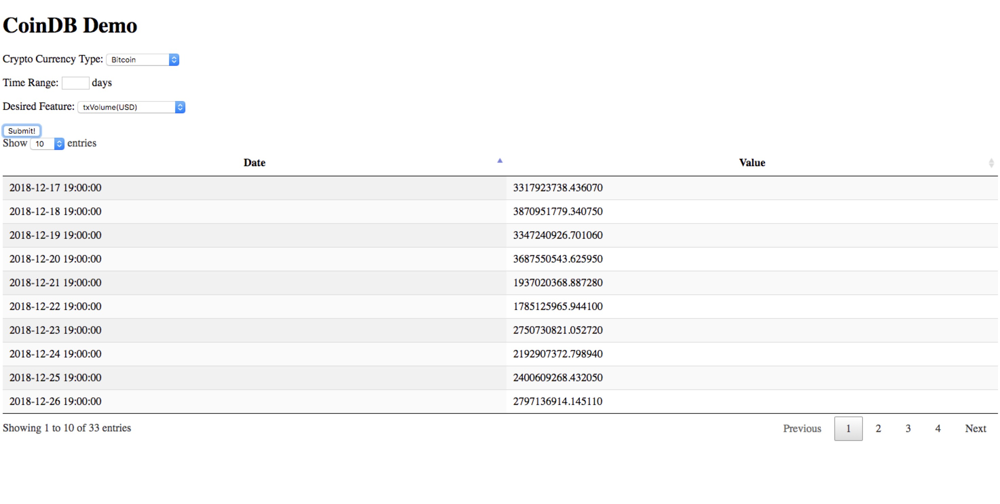

# CryptoDB
The propose of this project is to design a automated script to update the database with the most current cryptocurrency data and obtain data from database.

## Environment variable

The script was written that the paramter of the database is obtained from the bash environment

`export DATABASE_USRNAME= <database username>`

`export DATABASE_PWD= <database password>`

`export DATABASE_NAME = <database name>`

## Setup

The required package is in requirement.txt. Run the following command in the application root directory

`pip install -r requirement.txt`

Following the installation above, run the following script:

`python create_database.py`

It will create a database named capital and create 17 tables included in it.

## Update database

The script automatically get the maximum time stamp from the database and set it as the start of the time range, and current time as the end of the time range.

To update the database to the current date:

`python update_database.py -a <desired update asset>`

The desired crypto coin should be separated with comma only

`default asset is btc,bch,ltc,eth,etc`

The initial run takes approximately 98 seconds (previously 192 seconds). It takes 18.92 seconds to download the data from the CoinMetrics API, and 79 seconds (182.51 seconds previously) to insert the rows into the database.


## Query 

The available feature: date, txvolume, adjustedtxvolume, txcount, marketcap, price, exchangevolume, realizedcap, generatedcoins, fees, activeaddresses, averagedifficulty, paymentcount, mediantxvalue, medianfee, blocksize, blockcount

The current version of script only support querying a set of features listed above with one type of crypto currency.

`python query.py -a <one desired crypto coin> -f <set of feature separated by comma> -t <task> (only here for future work) -b <begin of time range> -e <end of time range> -h < bool, print usage >`

The script will parse the dictionary and return the data in the following format:

|Date(MM-DD-YYYY)|Feature1|
|-----|---------|


`===================================================`

|Date(MM-DD-YYYY)|Feature2|
|-----|---------|

`===================================================`

# Web Application Backend

The backend script uses Flask micro web frame work (http://flask.pocoo.org/). Simply initiate the script with the following command:

`python web.py`

The script should start running immediately given that the database was setup correctly with the procedure described above. The following message should be displayed right after the app is running:
```
* Serving Flask app "web" (lazy loading)
 * Environment: production
   WARNING: Do not use the development server in a production environment.
   Use a production WSGI server instead.
 * Debug mode: on
 * Running on http://127.0.0.1:5000/ (Press CTRL+C to quit)
 * Restarting with stat
 * Debugger is active!
 * Debugger PIN: 126-194-973
 ```
 The given internet address with "test" (`http://127.0.0.1:5000/test`) should direct you to the coinDB web interface page. The interface is shown below:



 
The currently available crypto currencies are Litecoin, Bitcoin, Bitcoin cash, Etherium, Etherium cash.

The currently available features are tax volume(USD), adjusted tax volume(USD)	tax count, market cap(USD), price(USD), exchange volume(USD), realized cap(USD)	generated coins, fees, active addresses, average difficulty, payment count	median tax value(USD), median fee, block size, block count.

The interface will query the given crypto currency and its feature with given time range (from now and 30 days (defualt) back). The day can be adjusted in the input field.

# To be continued..